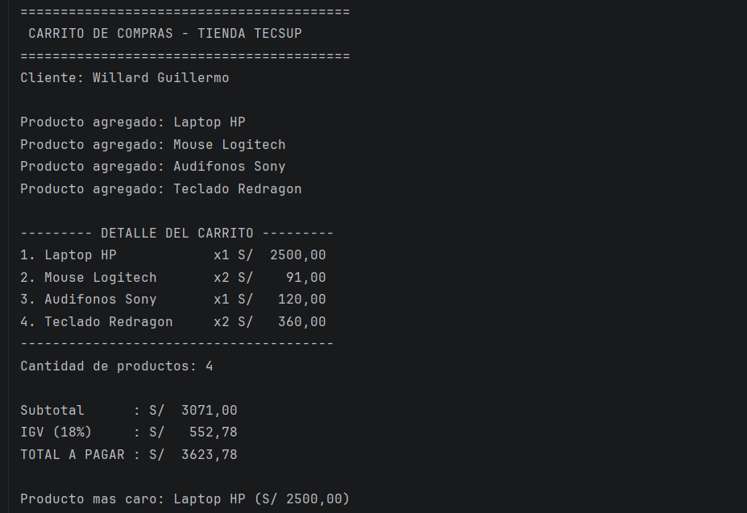
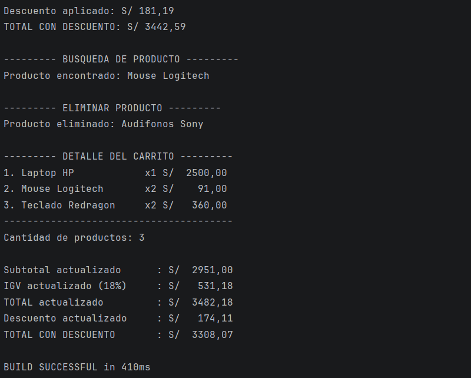

## Laboratorio 02 - Carrito de Compras en Kotlin

## Datos del estudiante

Nombre: Willard Guillermo
Curso: Programación en Móviles
Laboratorio: 02
Lenguaje: Kotlin

## Descripción

En este laboratorio se desarrolló la lógica de un carrito de compras utilizando Kotlin.

El programa permite registrar productos con nombre, precio y cantidad, almacenarlos en una lista mutable y realizar diferentes operaciones sobre ellos.

Se implementaron funciones para:

* Calcular el subtotal de los productos.
* Calcular el IGV del 18%.
* Calcular el total a pagar.
* Mostrar el detalle del carrito con columnas alineadas.
* Identificar el producto más caro.
* Aplicar descuentos según el monto total utilizando when.
* Buscar productos utilizando find.
* Eliminar productos utilizando removeIf.
* Recalcular los totales después de eliminar un producto.

Modelo de datos

Para representar cada producto se utilizó una data class:

data class Producto(
val nombre: String,
val precio: Double,
var cantidad: Int
)

¿Por qué nombre y precio son val, pero cantidad es var?

nombre y precio fueron declarados con val porque son valores que no deberían cambiar después de crear un producto.

Por ejemplo, si se crea:

Producto("Laptop HP", 2500.0, 1)

el nombre Laptop HP y su precio 2500.0 permanecen constantes.

En cambio, cantidad se declaró con var porque puede ser necesario modificarla durante el uso del carrito.

Por ejemplo:

producto.cantidad = 2

Si intentara modificar el precio de esta manera:

producto.precio = 3000.0

Kotlin mostraría un error porque precio fue declarado con val y, por lo tanto, no puede reasignarse.

## Resultado final

El programa muestra en consola:

* Datos del cliente.
* Productos agregados.
* Detalle del carrito.
* Cantidad de productos.
* Subtotal.
* IGV.
* Total a pagar.
* Producto más caro.
* Descuento aplicado.
* Total con descuento.
* Búsqueda de productos.
* Eliminación de productos.
* Totales actualizados después de eliminar un producto.

## Capturas de ejecución

  

  

