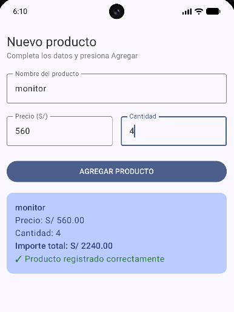
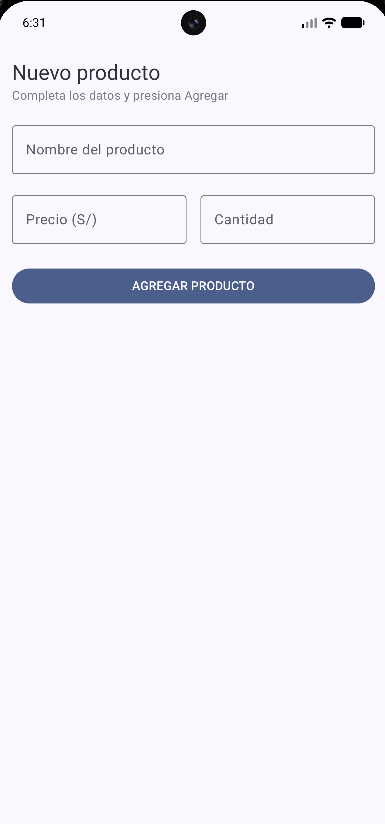

# Lab03 Registro de Producto - Jetpack Compose

## Datos del estudiante

Nombre:
TU NOMBRE

Curso:
Programación en Móviles

## Descripción

Aplicación móvil desarrollada con Jetpack Compose que permite registrar productos ingresando nombre, precio y cantidad.

La aplicación utiliza:
- Column y Row para organizar la interfaz.
- OutlinedTextField para ingreso de datos.
- Button para ejecutar acciones.
- Card para mostrar el resumen del producto.
- remember y mutableStateOf para manejar el estado.

## Capturas

### Pantalla inicial

### Producto registrado

## Pregunta de reflexión

### ¿Qué pasaría si declaras las variables de los campos SIN remember?

Si las variables se declaran sin remember, Compose no conservaría el estado de los datos ingresados. Al recomponerse la pantalla, los valores volverían a su estado inicial y el usuario perdería lo escrito en los campos.

`remember` permite mantener los valores mientras la composición permanezca activa.